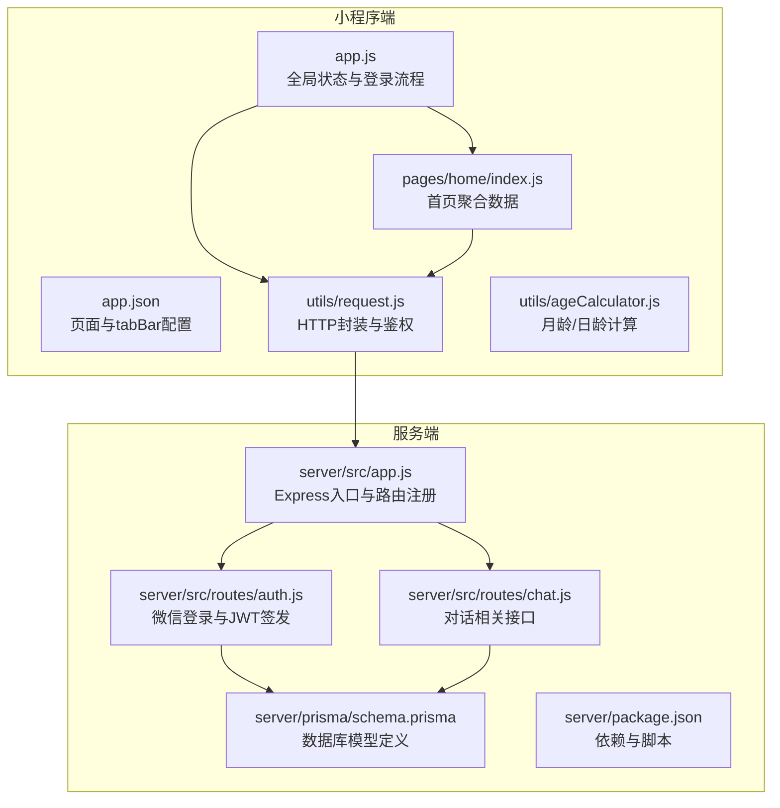
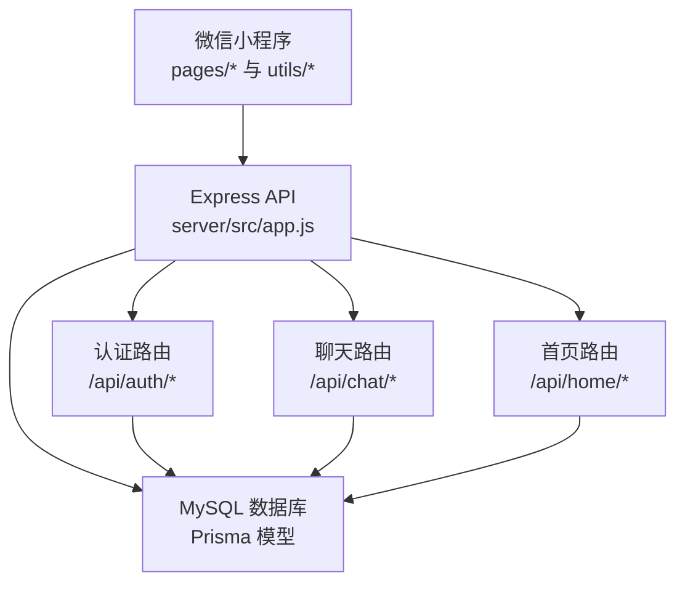
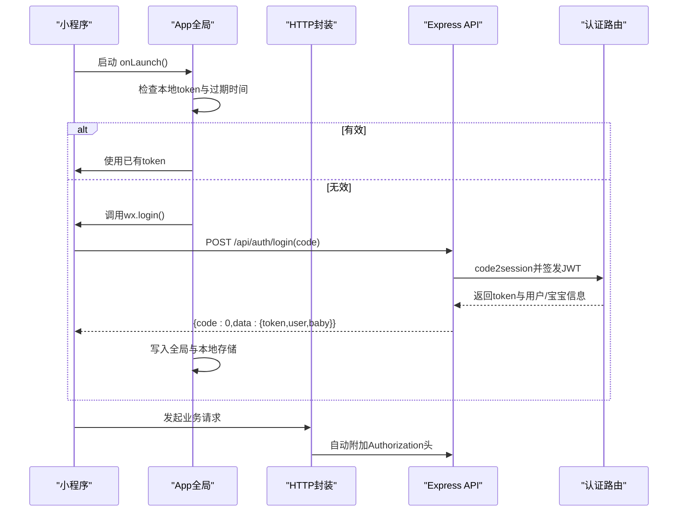
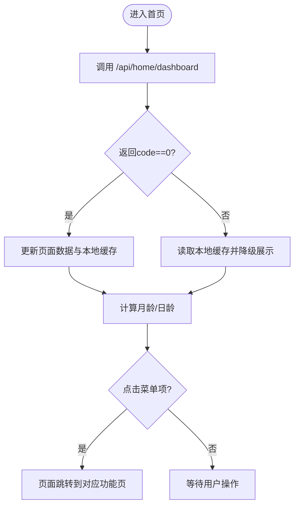
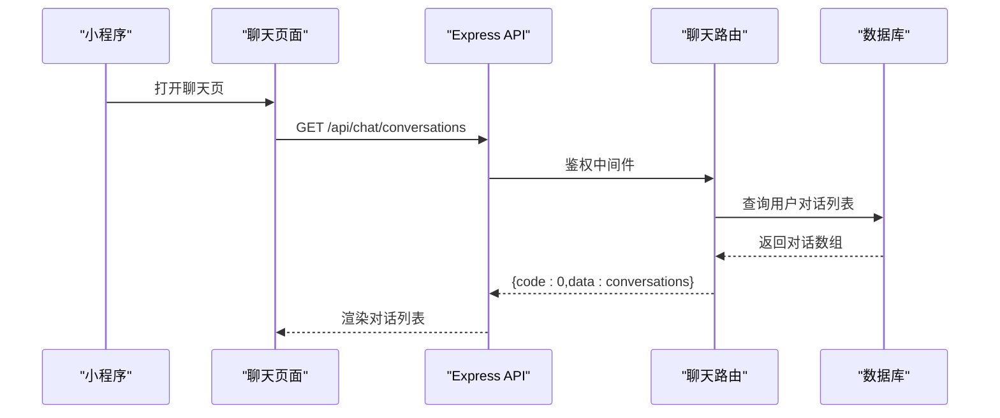
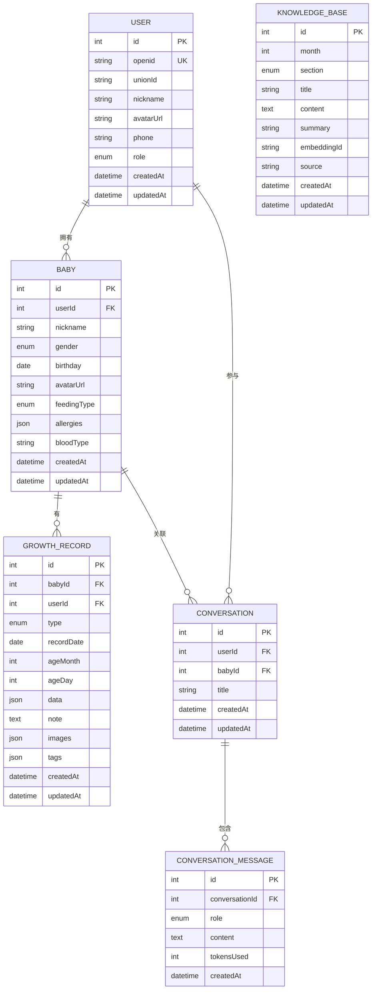
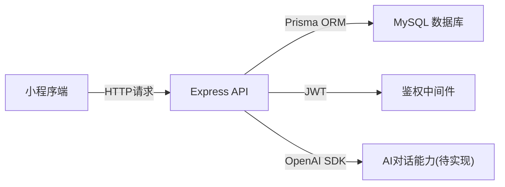

# 项目概述

<cite>
**本文引用的文件**
- [miniprogram/app.js](file://miniprogram/app.js)
- [miniprogram/app.json](file://miniprogram/app.json)
- [miniprogram/utils/request.js](file://miniprogram/utils/request.js)
- [miniprogram/utils/ageCalculator.js](file://miniprogram/utils/ageCalculator.js)
- [miniprogram/pages/home/index.js](file://miniprogram/pages/home/index.js)
- [server/src/app.js](file://server/src/app.js)
- [server/package.json](file://server/package.json)
- [server/src/routes/auth.js](file://server/src/routes/auth.js)
- [server/src/routes/chat.js](file://server/src/routes/chat.js)
- [server/prisma/schema.prisma](file://server/prisma/schema.prisma)
</cite>

## 目录
1. [引言](#引言)
2. [项目结构](#项目结构)
3. [核心组件](#核心组件)
4. [架构总览](#架构总览)
5. [详细组件分析](#详细组件分析)
6. [依赖分析](#依赖分析)
7. [性能考虑](#性能考虑)
8. [故障排查指南](#故障排查指南)
9. [结论](#结论)

## 引言
本项目“安心育儿”是一个面向新手父母的微信小程序应用，旨在通过智能聊天、成长记录与知识百科等能力，提供一站式育儿支持。项目采用前后端分离架构：前端为微信小程序，后端为基于 Node.js 的 Express API 服务，配合 Prisma ORM 和 MySQL 数据库存储用户、宝宝、成长记录、对话历史与知识库等数据。

项目核心目标包括：
- 提供便捷的宝宝成长记录与可视化报告
- 基于月龄的知识库问答与育儿建议
- 以微信生态为基础的轻量化使用体验
- 通过统一鉴权与限流保障安全与稳定性

## 项目结构
项目采用典型的“小程序 + 服务端”的双端结构：
- 小程序端（miniprogram）：页面、组件、样式、工具函数与全局配置
- 服务端（server）：Express 应用、路由、中间件、数据库模型与脚本

图表来源
- [miniprogram/app.js:1-69](file://miniprogram/app.js#L1-L69)
- [miniprogram/app.json:1-60](file://miniprogram/app.json#L1-L60)
- [miniprogram/pages/home/index.js:1-114](file://miniprogram/pages/home/index.js#L1-L114)
- [miniprogram/utils/request.js:1-97](file://miniprogram/utils/request.js#L1-L97)
- [miniprogram/utils/ageCalculator.js:1-86](file://miniprogram/utils/ageCalculator.js#L1-L86)
- [server/src/app.js:1-65](file://server/src/app.js#L1-L65)
- [server/src/routes/auth.js:1-84](file://server/src/routes/auth.js#L1-L84)
- [server/src/routes/chat.js:1-57](file://server/src/routes/chat.js#L1-L57)
- [server/prisma/schema.prisma:1-189](file://server/prisma/schema.prisma#L1-L189)
- [server/package.json:1-31](file://server/package.json#L1-L31)

章节来源
- [miniprogram/app.js:1-69](file://miniprogram/app.js#L1-L69)
- [miniprogram/app.json:1-60](file://miniprogram/app.json#L1-L60)
- [server/src/app.js:1-65](file://server/src/app.js#L1-L65)

## 核心组件
- 小程序全局与登录
  - 全局状态管理与登录态校验，集成微信登录换取 token，并持久化存储
  - 登录成功后根据是否已有宝宝信息决定是否引导完善资料
- HTTP 请求封装
  - 统一注入 Authorization 头、自动处理业务错误与网络异常
  - Token 过期时触发自动刷新流程
- 首页聚合数据
  - 展示宝宝信息、最新成长记录、当月提示与个性化推荐
  - 支持下拉刷新与本地降级策略
- 年龄计算工具
  - 提供月龄/日龄计算与友好日期展示
- 服务端入口与路由
  - Express 应用注册 CORS、JSON 解析、限流与健康检查
  - 注册认证、成长记录、知识库、聊天、上传与首页相关路由
- 数据模型
  - 用户、宝宝、成长记录、对话会话与消息、知识库条目、收藏等模型

章节来源
- [miniprogram/app.js:10-67](file://miniprogram/app.js#L10-L67)
- [miniprogram/utils/request.js:21-86](file://miniprogram/utils/request.js#L21-L86)
- [miniprogram/pages/home/index.js:46-71](file://miniprogram/pages/home/index.js#L46-L71)
- [miniprogram/utils/ageCalculator.js:7-41](file://miniprogram/utils/ageCalculator.js#L7-L41)
- [server/src/app.js:14-55](file://server/src/app.js#L14-L55)
- [server/prisma/schema.prisma:14-189](file://server/prisma/schema.prisma#L14-L189)

## 架构总览
系统采用前后端分离架构，小程序作为前端客户端，通过 HTTP 与后端 API 通信；后端提供 REST 风格接口，使用 JWT 进行鉴权，Prisma 管理 MySQL 数据库。

图表来源
- [server/src/app.js:33-47](file://server/src/app.js#L33-L47)
- [server/src/routes/auth.js:10-77](file://server/src/routes/auth.js#L10-L77)
- [server/src/routes/chat.js:6-54](file://server/src/routes/chat.js#L6-L54)
- [server/prisma/schema.prisma:14-189](file://server/prisma/schema.prisma#L14-L189)

## 详细组件分析

### 登录与鉴权流程
小程序启动时检查本地 token 是否有效，若无效则发起微信登录换取 token，并将用户与宝宝信息写入全局状态与本地存储。后续请求通过统一的 HTTP 封装自动附加 Authorization 头。

图表来源
- [miniprogram/app.js:18-67](file://miniprogram/app.js#L18-L67)
- [miniprogram/utils/request.js:21-37](file://miniprogram/utils/request.js#L21-L37)
- [server/src/routes/auth.js:10-77](file://server/src/routes/auth.js#L10-L77)

章节来源
- [miniprogram/app.js:10-67](file://miniprogram/app.js#L10-L67)
- [miniprogram/utils/request.js:21-86](file://miniprogram/utils/request.js#L21-L86)
- [server/src/routes/auth.js:10-77](file://server/src/routes/auth.js#L10-L77)

### 首页数据聚合与菜单导航
首页负责加载聚合数据（宝宝信息、最新成长记录、当月提示与推荐），并提供多种功能入口（成长记录、喂养/睡眠/疫苗/里程碑/照片记录、成长报告、个人中心）。支持下拉刷新与本地降级。

图表来源
- [miniprogram/pages/home/index.js:46-112](file://miniprogram/pages/home/index.js#L46-L112)
- [miniprogram/utils/ageCalculator.js:7-41](file://miniprogram/utils/ageCalculator.js#L7-L41)

章节来源
- [miniprogram/pages/home/index.js:24-112](file://miniprogram/pages/home/index.js#L24-L112)
- [miniprogram/utils/ageCalculator.js:7-41](file://miniprogram/utils/ageCalculator.js#L7-L41)

### 聊天与对话管理（接口层）
聊天模块当前提供对话列表、详情查询与删除接口，AI 对话流式响应在后续版本实现。所有聊天相关接口均受鉴权中间件保护。

图表来源
- [server/src/routes/chat.js:14-42](file://server/src/routes/chat.js#L14-L42)
- [server/src/app.js:45-46](file://server/src/app.js#L45-L46)

章节来源
- [server/src/routes/chat.js:14-54](file://server/src/routes/chat.js#L14-L54)
- [server/src/app.js:33-47](file://server/src/app.js#L33-L47)

### 数据模型与关系
数据库模型围绕用户、宝宝、成长记录、对话与知识库展开，支持多对一/一对多关系与索引优化。

图表来源
- [server/prisma/schema.prisma:14-189](file://server/prisma/schema.prisma#L14-L189)

章节来源
- [server/prisma/schema.prisma:14-189](file://server/prisma/schema.prisma#L14-L189)

## 依赖分析
- 小程序端
  - 依赖统一的 HTTP 封装进行网络请求，自动处理鉴权与错误
  - 依赖年龄计算工具进行月龄/日龄展示
- 服务端
  - Express 提供 Web 服务与路由
  - Prisma 管理数据库模型与查询
  - JWT 用于鉴权，CORS 与限流保障跨域与安全
  - OpenAI SDK 为后续 AI 对话能力预留

图表来源
- [server/src/app.js:14-25](file://server/src/app.js#L14-L25)
- [server/package.json:14-29](file://server/package.json#L14-L29)
- [server/src/routes/chat.js:6-12](file://server/src/routes/chat.js#L6-L12)

章节来源
- [server/src/app.js:14-25](file://server/src/app.js#L14-L25)
- [server/package.json:14-29](file://server/package.json#L14-L29)

## 性能考虑
- 前端
  - 下拉刷新与本地降级策略提升弱网与首屏体验
  - 统一的 loading 与错误提示减少重复逻辑
- 后端
  - 全局限流降低突发流量对服务的影响
  - 健康检查接口便于监控与弹性伸缩
- 数据层
  - 关键字段建立索引，减少查询成本
  - JSON 字段用于灵活记录结构，注意查询与排序限制

## 故障排查指南
- 登录失败
  - 检查微信 code2session 返回与环境变量配置
  - 确认 JWT 秘钥与过期时间设置
- 请求失败
  - 检查 Authorization 头是否正确注入
  - 观察业务错误码与消息提示，必要时触发自动刷新
- 数据不一致
  - 首页降级逻辑会回退到本地缓存，确认本地存储完整性
- 接口不存在
  - 检查路由注册顺序与路径拼接

章节来源
- [server/src/routes/auth.js:18-30](file://server/src/routes/auth.js#L18-L30)
- [miniprogram/utils/request.js:48-62](file://miniprogram/utils/request.js#L48-L62)
- [miniprogram/pages/home/index.js:62-70](file://miniprogram/pages/home/index.js#L62-L70)
- [server/src/app.js:49-52](file://server/src/app.js#L49-L52)

## 结论
“安心育儿”项目通过清晰的前后端分层与统一的鉴权机制，构建了可扩展的育儿服务平台。小程序端聚焦用户体验与数据聚合，服务端提供稳定可靠的 API 与完善的数据库模型。未来可在聊天模块引入 AI 对话能力，并持续优化数据查询与缓存策略，进一步提升性能与可用性。