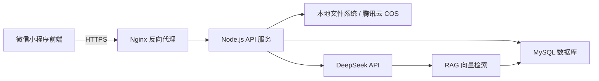
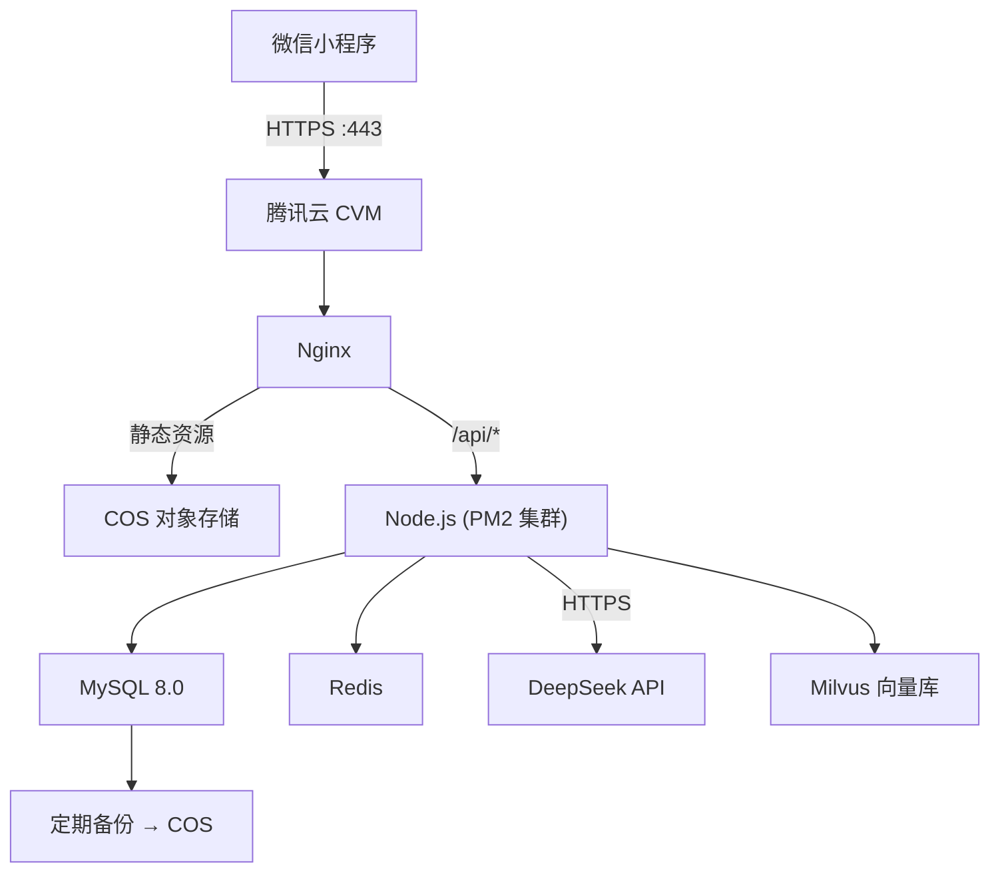

# 🍼 「安心育儿」微信小程序 — 产品需求文档（PRD）

> 版本：v1.0  
> 更新日期：2026-06-05  
> 项目定位：新手妈妈的智能育儿伴侣

---

## 一、产品概述

### 1.1 产品定位

「安心育儿」是一款面向 0-1 岁婴儿新手父母的微信小程序，旨在通过 **科学的月龄知识 + 个性化成长记录 + AI 智能问答**，帮助新手宝妈了解宝宝各阶段发育特征，缓解育儿焦虑，获得专业、温暖的育儿支持。

### 1.2 目标用户

| 用户类型 | 描述 | 核心痛点 |
|---------|------|---------|
| 新手妈妈（主要） | 孕期~1岁婴儿的母亲，25-38岁 | 缺乏育儿经验，对宝宝异常表现容易焦虑 |
| 新手爸爸（次要） | 希望参与育儿的父亲 | 不了解婴儿需求，不知如何配合 |
| 家庭长辈（辅助） | 帮忙带娃的爷爷奶奶/外公外婆 | 传统观念与科学育儿的冲突 |

### 1.3 核心价值主张

- **知道**：每个月宝宝会经历什么？提前了解，不再手忙脚乱
- **记录**：宝宝的每一步成长都值得被记住
- **安心**：AI 助手 24 小时在线，随时解答育儿困惑

---

## 二、功能架构

### 2.1 功能全景图

```mermaid
graph TD
    A["安心育儿小程序"] --> B["首页"]
    A --> C["月龄百科"]
    A --> D["宝宝成长"]
    A --> E["AI 育儿助手"]
    A --> F["我的"]

    B --> B1["宝宝日龄卡片"]
    B --> B2["快捷功能入口"]
    B --> B3["今日推荐阅读"]
    B --> B4["本月发育提醒"]

    C --> C1["月龄时间轴 0-12月"]
    C --> C2["当月发育特征"]
    C --> C3["喂养指南"]
    C --> C4["睡眠指南"]
    C --> C5["常见问题与应对"]
    C --> C6["发育里程碑"]

    D --> D1["宝宝档案"]
    D --> D2["成长记录时间线"]
    D --> D3["身高体重曲线"]
    D --> D4["里程碑相册"]
    D --> D5["月度成长报告"]

    E --> E1["智能对话"]
    E --> E2["基于记录的个性化建议"]
    E --> E3["焦虑情绪安抚"]
    E --> E4["紧急情况指引"]
    E --> E5["历史对话记录"]

    F --> F1["个人信息管理"]
    F --> F2["宝宝信息编辑"]
    F --> F3["消息通知"]
    F --> F4["收藏/历史"]
    F --> F5["设置"]
```



### 2.2 页面结构

```
pages/
├── home/index                    # 首页
├── knowledge/month-detail        # 月龄百科详情
├── baby/
│   ├── profile                   # 宝宝档案
│   ├── growth-record             # 成长记录时间线
│   ├── add-record                # 添加记录
│   └── monthly-report            # 月度报告
├── chat/
│   ├── index                     # AI 助手对话页
│   └── history                   # 历史对话
├── mine/
│   ├── index                     # 个人中心
│   ├── settings                  # 设置
│   └── favorites                 # 我的收藏
└── onboarding/
    └── index                     # 首次引导（录入宝宝信息）
```

---

## 三、核心功能详细设计

### 3.1 📅 月龄百科（核心模块）

这是小程序的**知识核心**，以月龄为轴线，系统化呈现 0-12 个月婴儿的发育知识。

#### 3.1.1 月龄时间轴入口页

**页面描述**：横向/纵向时间轴展示 0-12 月龄卡片，当前月龄高亮，已过月龄标记已完成。

**数据结构（每个月龄）**：

```json
{
  "month": 3,
  "title": "第3个月",
  "subtitle": "社交小能手上线啦 🌟",
  "status": "current",
  "sections": {
    "physiology": {
      "title": "生理发育特征",
      "items": [
        {
          "label": "身高",
          "avgBoy": "61.0-64.5cm",
          "avgGirl": "59.5-63.0cm",
          "description": "本月平均增长约2.5cm"
        },
        {
          "label": "体重",
          "avgBoy": "5.8-7.5kg",
          "avgGirl": "5.3-6.9kg",
          "description": "体重增长速度较前两个月放缓"
        },
        {
          "label": "头围",
          "avgBoy": "39.5-41.5cm",
          "avgGirl": "38.5-40.5cm",
          "description": "脑发育迅速，头围持续增长"
        }
      ]
    },
    "abilities": {
      "title": "能力发展",
      "milestones": [
        { "icon": "👀", "text": "眼睛可以追踪移动物体 180°" },
        { "icon": "✊", "text": "双手可以握在一起，会吃手" },
        { "icon": "😊", "text": "出现社交性微笑，逗他会笑出声" },
        { "icon": "🗣️", "text": "开始发出 '咕咕' 的声音" },
        { "icon": "💪", "text": "趴着时能用前臂支撑抬头 45°-90°" }
      ]
    },
    "feeding": {
      "title": "喂养指南",
      "type": "纯母乳/配方奶",
      "frequency": "每天 6-8 次，每次约 120-150ml",
      "tips": [
        "此阶段仍以奶为主食，不需要添加辅食",
        "可以适当拉长喂奶间隔，建立规律作息",
        "注意观察宝宝的饥饿信号：舔嘴唇、吃手、转头寻找"
      ],
      "warning": "不建议此阶段添加任何固体食物，包括米糊"
    },
    "sleep": {
      "title": "睡眠指南",
      "totalHours": "14-17 小时/天",
      "nightSleep": "夜间连续睡眠可达 5-6 小时",
      "dayNap": "白天 3-4 次小睡，每次 30 分钟-2 小时",
      "tips": [
        "开始建立睡前仪式感（洗澡→喂奶→拍嗝→放床）",
        "夜间喂奶时可以保持灯光昏暗、减少互动",
        "注意安全睡眠：仰卧、无杂物、合适的室温"
      ]
    },
    "commonIssues": {
      "title": "常见问题与应对",
      "issues": [
        {
          "question": "宝宝总是吃手怎么办？",
          "answer": "3个月的宝宝吃手是正常的口欲期表现，是自我安抚和探索的方式。保持手部清洁即可，不需要强行制止。",
          "anxietyLevel": "low"
        },
        {
          "question": "宝宝吐奶很频繁正常吗？",
          "answer": "溢奶在3月龄仍然常见，因为胃部括约肌尚未发育成熟。喂奶后竖抱拍嗝 15-20 分钟可有效缓解。如果是喷射状呕吐或伴随体重不增长，需要就医。",
          "anxietyLevel": "medium"
        },
        {
          "question": "宝宝夜间频繁醒来怎么办？",
          "answer": "3个月宝宝夜醒 2-3 次属于正常范围。建议白天保证充足的喂奶量，夜间减少刺激，逐步建立昼夜节律。",
          "anxietyLevel": "high"
        }
      ]
    },
    "earlyEducation": {
      "title": "早教互动",
      "activities": [
        {
          "name": "黑白→彩色卡片",
          "duration": "每天 3-5 分钟",
          "description": "宝宝开始对颜色产生偏好，红色和对比色最受欢迎"
        },
        {
          "name": "俯卧练习（Tummy Time）",
          "duration": "每天累计 30-60 分钟",
          "description": "在宝宝清醒时多趴，锻炼颈部和背部肌肉"
        },
        {
          "name": "对话互动",
          "duration": "随时",
          "description": "模仿宝宝的声音，用夸张的表情和他'聊天'"
        }
      ]
    }
  }
}
```

#### 3.1.2 月龄详情页 UI 布局

```
┌─────────────────────────────┐
│  ← 第3个月 · 社交小能手上线   │
├─────────────────────────────┤
│  ┌──────────────────────┐   │
│  │  📊 发育参考值          │   │  ← 可折叠卡片
│  │  身高 61-64.5cm       │   │
│  │  体重 5.8-7.5kg       │   │
│  │  对比宝宝 →            │   │  ← 跳转对比
│  └──────────────────────┘   │
│                             │
│  🌟 能力发展                 │
│  ┌──┐ ┌──┐ ┌──┐            │  ← 横向滚动卡片
│  │👀│ │😊│ │💪│            │
│  │追│ │微│ │抬│            │
│  │视│ │笑│ │头│            │
│  └──┘ └──┘ └──┘            │
│                             │
│  🍼 喂养指南                 │
│  [展开/收起]                │
│                             │
│  😴 睡眠指南                 │
│  [展开/收起]                │
│                             │
│  ⚠️ 常见问题                 │
│  Q: 宝宝总是吃手怎么办？      │
│  Q: 吐奶频繁正常吗？         │
│  Q: 夜间频繁醒来？           │
│                             │
│  ────────────────────       │
│  💬 对此有疑问？问问AI助手    │  ← 底部引导
│  [去提问 →]                 │
└─────────────────────────────┘
```

### 3.2 👶 宝宝成长记录

#### 3.2.1 宝宝档案

**首次使用引导流程**：
```
欢迎页 → 输入宝宝昵称 → 选择性别 → 输入出生日期 → 选择喂养方式 → 完成
```

**宝宝信息结构**：

```json
{
  "baby": {
    "id": "baby_001",
    "nickname": "小糯米",
    "gender": "female",
    "birthday": "2026-02-15",
    "ageMonths": 3,
    "ageDays": 110,
    "avatar": "https://...",
    "feedingType": "breast",
    "allergies": [],
    "bloodType": "A"
  }
}
```

#### 3.2.2 成长记录数据模型

```json
{
  "record": {
    "id": "rec_001",
    "babyId": "baby_001",
    "type": "growth",
    "date": "2026-06-05",
    "ageMonth": 3,
    "ageDay": 110,
    "data": {
      "height": 62.5,
      "weight": 6.3,
      "headCircumference": 40.2
    },
    "note": "今天去体检，医生说发育很好",
    "images": [],
    "tags": ["体检"]
  }
}
```

**记录类型枚举**：

| 类型 | 字段 | 图标 |
|------|------|------|
| 身高体重 | height, weight, headCircumference | 📏 |
| 喂养记录 | feedType, amount, duration | 🍼 |
| 睡眠记录 | sleepTime, wakeTime, quality | 😴 |
| 里程碑 | milestoneTitle, description | 🌟 |
| 照片/视频 | mediaFiles, description | 📸 |
| 健康记录 | temperature, symptoms, medication | 🏥 |
| 自由记录 | text, images | 📝 |

#### 3.2.3 月度成长报告

每月自动生成一份成长报告，包含：
- 本月身高体重增长曲线及与 WHO 标准对比
- 本月达成的重要里程碑
- 本月喂养/睡眠数据统计
- 下个月发育预告及准备事项
- AI 助手根据记录给出的个性化小结

### 3.3 🤖 AI 育儿助手（核心差异化功能）

#### 3.3.1 产品定位

不是冷冰冰的问答机器，而是一位 **温暖、专业、有同理心** 的育儿顾问。

**核心人格设定**：
- 称呼用户为"亲爱的宝妈"或用户自定义昵称
- 回答专业但温和，避免制造焦虑
- 遇到紧急情况（高烧、抽搐等）首先建议就医
- 适当安抚情绪，不只是给信息
- 所有建议标注信息来源（AAP/WHO/国内儿科学会等）

#### 3.3.2 上下文感知的智能问答

**AI 需要结合的上下文信息**：

```json
{
  "context": {
    "baby": {
      "ageMonths": 3,
      "ageDays": 110,
      "gender": "female",
      "feedingType": "breast",
      "latestGrowth": {
        "height": 62.5,
        "weight": 6.3,
        "date": "2026-06-01"
      },
      "recentRecords": [
        { "type": "milestone", "text": "第一次翻身", "date": "2026-05-28" },
        { "type": "health", "text": "轻微湿疹", "date": "2026-05-20" }
      ],
      "recentConcerns": ["湿疹反复", "夜间频繁醒"]
    },
    "currentMonth": 3,
    "conversationHistory": []
  }
}
```

#### 3.3.3 对话场景分类

| 场景 | 示例问题 | AI 响应策略 |
|------|---------|------------|
| 日常护理 | "3个月宝宝一天吃几次奶？" | 结合月龄给出具体建议 + 参考来源 |
| 异常症状 | "宝宝大便有血丝怎么办？" | 安抚情绪 → 可能原因 → 建议就医标准 → 紧急时直接建议去医院 |
| 焦虑缓解 | "宝宝体重偏轻是不是我奶不够？" | 共情安抚 → 客观数据分析 → 可行方案 → 鼓励 |
| 发育对比 | "别人家3个月都会翻身了" | 正常化个体差异 → 给出参考范围 → 提供促进方法 |
| 紧急情况 | "宝宝发烧38.5了！" | 首先建议就医 → 给出就医前护理建议 → 安抚情绪 |

#### 3.3.4 AI 对话页 UI 设计

```
┌─────────────────────────────┐
│  🤖 安心育儿助手              │
│  ─────────────────────────  │
│                             │
│  ┌─────────────────────┐    │
│  │ 🤖 你好呀~小糯米现在   │    │  ← AI 气泡（左侧）
│  │ 3个多月了，正是爱笑的   │    │     浅珊瑚粉背景
│  │ 时候呢😊 有什么想问的   │    │
│  │ 尽管说~               │    │
│  └─────────────────────┘    │
│                             │
│        ┌─────────────────┐  │
│        │ 宝宝最近总是吐奶  │  │  ← 用户气泡（右侧）
│        │ 正常吗？好担心😥 │  │     白色背景
│        └─────────────────┘  │
│                             │
│  ┌─────────────────────┐    │
│  │ 🤖 宝妈别担心~吐奶在   │    │
│  │ 3月龄宝宝中非常常见哦！ │    │
│  │                      │    │
│  │ 📋 常见原因：          │    │
│  │ · 胃部括约肌未发育成熟  │    │
│  │ · 吃奶时吞入空气       │    │
│  │                      │    │
│  │ 💡 建议试试：          │    │
│  │ · 喂奶后竖抱15-20分钟  │    │
│  │ · 少量多次喂养         │    │
│  │ · 喂奶时保持半坐姿     │    │
│  │                      │    │
│  │ ⚠️ 如果出现以下情况     │    │
│  │ 建议就医：             │    │
│  │ · 喷射状呕吐           │    │
│  │ · 呕吐物带血或绿色     │    │
│  │ · 体重持续不增长       │    │
│  │                      │    │
│  │ 📖 参考：AAP育儿百科   │    │
│  └─────────────────────┘    │
│                             │
│  ┌─────────────────────┐    │
│  │ 🏷️ 猜你还想问：       │    │  ← 智能推荐问题
│  │ [怎么拍嗝] [喂奶姿势]  │    │
│  └─────────────────────┘    │
│                             │
│  ┌─────────────┐  [📎] [🎤] │  ← 输入区
│  │ 输入你的问题.. │  [发送]  │
│  └─────────────┘           │
└─────────────────────────────┘
```

#### 3.3.5 快捷提问入口

在以下页面嵌入 AI 快捷入口：
- **月龄详情页底部**：「对此有疑问？问问 AI →」
- **成长记录页**：「宝宝数据和标准差太多？」浮动气泡
- **首页**：常驻 AI 助手入口卡片

### 3.4 🏠 首页设计

```
┌─────────────────────────────┐
│  早上好，宝妈 ☀️              │
├─────────────────────────────┤
│  ┌──────────────────────┐   │
│  │  🌟 小糯米今天 110 天啦 │   │  ← 宝宝日龄卡片
│  │  [头像]               │   │     渐变背景
│  │  身高 62.5cm 体重 6.3kg │   │
│  │  距下次体检还有 12 天   │   │
│  └──────────────────────┘   │
│                             │
│  ── 快捷功能 ──              │
│  ┌──┐ ┌──┐ ┌──┐ ┌──┐      │  ← 宫格入口
│  │📏│ │🍼│ │😴│ │💉│      │
│  │记录│ │喂养│ │睡眠│ │疫苗│      │
│  └──┘ └──┘ └──┘ └──┘      │
│                             │
│  ── 本月发育提醒 ──          │
│  ┌──────────────────────┐   │  ← 黄色提醒卡片
│  │ ⚡ 3月龄该关注：       │   │
│  │ · 俯卧练习时间增加     │   │
│  │ · 开始建立睡眠仪式     │   │
│  │ · 第4个月疫苗即将到来  │   │
│  └──────────────────────┘   │
│                             │
│  ── 今日推荐 ──              │
│  ┌──────────────────────┐   │  ← 内容卡片
│  │ [图] 3月龄早教指南     │   │
│  │ 阅读 2.3k · ❤ 186    │   │
│  └──────────────────────┘   │
│  ┌──────────────────────┐   │
│  │ [图] 如何判断奶量够不够 │   │
│  │ 阅读 1.8k · ❤ 142    │   │
│  └──────────────────────┘   │
│                             │
│  ── 和 AI 聊聊 ──           │
│  ┌──────────────────────┐   │  ← AI 入口卡片
│  │ 🤖 有什么育儿困惑？     │   │     渐变薄荷绿背景
│  │ 我来帮你解答 →          │   │
│  └──────────────────────┘   │
│                             │
├─────────────────────────────┤
│  🏠首页  📖百科  👶宝宝  💬AI │  ← TabBar
└─────────────────────────────┘
```

---

## 四、0-12 月龄知识体系大纲

每个月龄包含以下 6 大板块：

| 月龄 | 主题关键词 | 重点关注 |
|------|-----------|---------|
| 0月 | 初来乍到 | 新生儿黄疸、脐带护理、母乳喂养建立、昼夜节律未形成 |
| 1月 | 慢慢适应 | 肠绞痛、猛长期、追视能力、开始有社交性微笑 |
| 2月 | 互动萌芽 | 抬头练习、发出声音、疫苗接种（五联/13价）、规律作息初建 |
| 3月 | 社交小能手 | 翻身、抓握、吐奶高峰、睡眠退化期 |
| 4月 | 探索世界 | 翻身熟练、口欲期高峰、睡眠倒退（4月龄睡眠退化）、辅食准备信号 |
| 5月 | 运动达人 | 主动抓物、靠坐、辅食引入时机、分离焦虑初现 |
| 6月 | 辅食启程 | 添加辅食、第一颗牙、独坐、体检+疫苗 |
| 7月 | 小馋猫 | 辅食种类扩展、爬行准备、认人、夜奶问题 |
| 8月 | 爬爬乐 | 爬行、手指食物、分离焦虑高峰、语言启蒙 |
| 9月 | 小小探险家 | 扶站、精细动作发展、辅食质地升级、认知发展 |
| 10月 | 咿呀学语 | 扶走、有意识叫爸妈、杯子喝水、自主进食引导 |
| 11月 | 准行走者 | 独站、理解简单指令、断夜奶、如厕意识萌芽 |
| 12月 | 周岁啦！ | 独走、说出有意义的词、从奶到饭的过渡、周岁体检 |

---

## 五、技术架构

### 5.1 技术选型总览



| 层级 | 技术方案 | 说明 |
|------|---------|------|
| **前端** | 微信原生小程序 + WXML/WXSS/JS | 性能最优，配合设计体系 |
| **后端框架** | Node.js + Express/Koa | JS 全栈，前后端语言统一 |
| **ORM** | Sequelize / Prisma | 数据模型管理，类型安全 |
| **数据库** | MySQL 8.0（自建实例） | 自主可控，避免厂商锁定 |
| **文件存储** | 腾讯云 COS（对象存储） | 图片/视频等非结构化数据 |
| **缓存** | Redis（自建实例） | 会话管理、热点知识缓存、限流 |
| **AI 大模型** | DeepSeek API | 性价比高，中文能力强 |
| **向量数据库** | Milvus / ChromaDB | RAG 育儿知识库向量检索 |
| **部署** | 腾讯云 CVM（云服务器） | Docker 容器化部署，自主可控 |
| **反向代理** | Nginx | HTTPS、负载均衡、静态资源 |
| **进程管理** | PM2 | Node.js 进程守护与集群管理 |

### 5.2 后端项目结构

```
server/
├── src/
│   ├── app.js                      # 应用入口
│   ├── config/
│   │   ├── database.js             # MySQL 连接配置
│   │   ├── redis.js                # Redis 配置
│   │   ├── deepseek.js             # DeepSeek API 配置
│   │   └── cos.js                  # 腾讯云 COS 配置
│   ├── routes/
│   │   ├── auth.js                 # 微信登录/用户认证
│   │   ├── baby.js                 # 宝宝档案管理
│   │   ├── growth.js               # 成长记录 CRUD
│   │   ├── knowledge.js            # 月龄百科接口
│   │   ├── chat.js                 # AI 对话接口
│   │   └── report.js               # 成长报告
│   ├── services/
│   │   ├── auth.service.js         # 登录态管理（JWT）
│   │   ├── baby.service.js         # 宝宝业务逻辑
│   │   ├── growth.service.js       # 成长记录逻辑
│   │   ├── knowledge.service.js    # 月龄知识检索
│   │   ├── ai.service.js           # DeepSeek 调用封装
│   │   ├── rag.service.js          # RAG 检索 + 上下文增强
│   │   └── report.service.js       # 月度报告生成
│   ├── models/
│   │   ├── User.js                 # 用户模型
│   │   ├── Baby.js                 # 宝宝模型
│   │   ├── GrowthRecord.js         # 成长记录模型
│   │   ├── Conversation.js         # 对话记录模型
│   │   └── KnowledgeBase.js        # 知识库模型
│   ├── middleware/
│   │   ├── auth.js                 # JWT 鉴权中间件
│   │   ├── rateLimit.js            # 请求限流
│   │   ├── validator.js            # 参数校验
│   │   └── errorHandler.js         # 全局错误处理
│   └── utils/
│       ├── wxLogin.js              # 微信 code2session
│       ├── cosUploader.js          # COS 上传封装
│       ├── ageCalculator.js        # 月龄/日龄计算
│       └── promptBuilder.js        # AI Prompt 构建
├── migrations/                     # 数据库迁移文件
├── seeders/                        # 种子数据（月龄知识）
├── scripts/
│   └── embed-knowledge.js          # 知识库向量化脚本
├── docker-compose.yml              # 本地开发环境
├── Dockerfile                      # 生产镜像构建
├── nginx.conf                      # Nginx 配置
├── .env.example                    # 环境变量模板
└── package.json
```

### 5.3 数据库设计（MySQL）

```sql
-- 用户表
CREATE TABLE users (
  id            BIGINT UNSIGNED AUTO_INCREMENT PRIMARY KEY,
  openid        VARCHAR(64) NOT NULL UNIQUE COMMENT '微信openid',
  union_id      VARCHAR(64) DEFAULT NULL COMMENT '微信unionid',
  nickname      VARCHAR(64) DEFAULT '' COMMENT '昵称',
  avatar_url    VARCHAR(512) DEFAULT '' COMMENT '头像',
  phone         VARCHAR(20) DEFAULT NULL COMMENT '手机号',
  role          ENUM('mother','father','grandparent','other') DEFAULT 'mother',
  created_at    DATETIME NOT NULL DEFAULT CURRENT_TIMESTAMP,
  updated_at    DATETIME NOT NULL DEFAULT CURRENT_TIMESTAMP ON UPDATE CURRENT_TIMESTAMP,
  INDEX idx_openid (openid)
) ENGINE=InnoDB DEFAULT CHARSET=utf8mb4 COMMENT='用户表';

-- 宝宝表
CREATE TABLE babies (
  id            BIGINT UNSIGNED AUTO_INCREMENT PRIMARY KEY,
  user_id       BIGINT UNSIGNED NOT NULL COMMENT '关联用户',
  nickname      VARCHAR(64) NOT NULL COMMENT '宝宝昵称',
  gender        ENUM('male','female') NOT NULL COMMENT '性别',
  birthday      DATE NOT NULL COMMENT '出生日期',
  avatar_url    VARCHAR(512) DEFAULT '' COMMENT '头像',
  feeding_type  ENUM('breast','formula','mixed') DEFAULT 'breast' COMMENT '喂养方式',
  allergies     JSON DEFAULT NULL COMMENT '过敏信息',
  blood_type    VARCHAR(8) DEFAULT NULL COMMENT '血型',
  created_at    DATETIME NOT NULL DEFAULT CURRENT_TIMESTAMP,
  updated_at    DATETIME NOT NULL DEFAULT CURRENT_TIMESTAMP ON UPDATE CURRENT_TIMESTAMP,
  FOREIGN KEY (user_id) REFERENCES users(id) ON DELETE CASCADE,
  INDEX idx_user_id (user_id)
) ENGINE=InnoDB DEFAULT CHARSET=utf8mb4 COMMENT='宝宝档案表';

-- 成长记录表
CREATE TABLE growth_records (
  id            BIGINT UNSIGNED AUTO_INCREMENT PRIMARY KEY,
  baby_id       BIGINT UNSIGNED NOT NULL,
  user_id       BIGINT UNSIGNED NOT NULL,
  type          ENUM('growth','feeding','sleep','milestone','photo','health','note') NOT NULL,
  record_date   DATE NOT NULL COMMENT '记录日期',
  age_month     TINYINT UNSIGNED DEFAULT 0 COMMENT '月龄(月)',
  age_day       SMALLINT UNSIGNED DEFAULT 0 COMMENT '日龄(天)',
  data          JSON NOT NULL COMMENT '记录数据(按type不同结构不同)',
  note          TEXT DEFAULT NULL COMMENT '备注文字',
  images        JSON DEFAULT NULL COMMENT '图片URL数组',
  tags          JSON DEFAULT NULL COMMENT '标签数组',
  created_at    DATETIME NOT NULL DEFAULT CURRENT_TIMESTAMP,
  updated_at    DATETIME NOT NULL DEFAULT CURRENT_TIMESTAMP ON UPDATE CURRENT_TIMESTAMP,
  FOREIGN KEY (baby_id) REFERENCES babies(id) ON DELETE CASCADE,
  FOREIGN KEY (user_id) REFERENCES users(id) ON DELETE CASCADE,
  INDEX idx_baby_date (baby_id, record_date),
  INDEX idx_baby_type (baby_id, type)
) ENGINE=InnoDB DEFAULT CHARSET=utf8mb4 COMMENT='成长记录表';

-- AI对话会话表
CREATE TABLE conversations (
  id            BIGINT UNSIGNED AUTO_INCREMENT PRIMARY KEY,
  user_id       BIGINT UNSIGNED NOT NULL,
  baby_id       BIGINT UNSIGNED NOT NULL,
  title         VARCHAR(128) DEFAULT '' COMMENT '对话摘要标题',
  created_at    DATETIME NOT NULL DEFAULT CURRENT_TIMESTAMP,
  updated_at    DATETIME NOT NULL DEFAULT CURRENT_TIMESTAMP ON UPDATE CURRENT_TIMESTAMP,
  FOREIGN KEY (user_id) REFERENCES users(id) ON DELETE CASCADE,
  FOREIGN KEY (baby_id) REFERENCES babies(id) ON DELETE CASCADE,
  INDEX idx_user_baby (user_id, baby_id)
) ENGINE=InnoDB DEFAULT CHARSET=utf8mb4 COMMENT='对话会话表';

-- AI对话消息表
CREATE TABLE conversation_messages (
  id              BIGINT UNSIGNED AUTO_INCREMENT PRIMARY KEY,
  conversation_id BIGINT UNSIGNED NOT NULL,
  role            ENUM('user','assistant','system') NOT NULL,
  content         TEXT NOT NULL COMMENT '消息内容',
  tokens_used     INT UNSIGNED DEFAULT 0 COMMENT '消耗token数',
  created_at      DATETIME NOT NULL DEFAULT CURRENT_TIMESTAMP,
  FOREIGN KEY (conversation_id) REFERENCES conversations(id) ON DELETE CASCADE,
  INDEX idx_conv_id (conversation_id)
) ENGINE=InnoDB DEFAULT CHARSET=utf8mb4 COMMENT='对话消息表';

-- 月龄知识库表
CREATE TABLE knowledge_base (
  id            BIGINT UNSIGNED AUTO_INCREMENT PRIMARY KEY,
  month         TINYINT UNSIGNED NOT NULL COMMENT '月龄 0-12',
  section       ENUM('physiology','abilities','feeding','sleep','common_issues','early_education') NOT NULL,
  title         VARCHAR(256) NOT NULL,
  content       TEXT NOT NULL COMMENT '知识正文',
  summary       VARCHAR(512) DEFAULT '' COMMENT '摘要',
  embedding_id  VARCHAR(64) DEFAULT NULL COMMENT '向量数据库中的ID',
  source        VARCHAR(128) DEFAULT '' COMMENT '信息来源(AAP/WHO等)',
  created_at    DATETIME NOT NULL DEFAULT CURRENT_TIMESTAMP,
  updated_at    DATETIME NOT NULL DEFAULT CURRENT_TIMESTAMP ON UPDATE CURRENT_TIMESTAMP,
  UNIQUE INDEX idx_month_section (month, section)
) ENGINE=InnoDB DEFAULT CHARSET=utf8mb4 COMMENT='月龄知识库表';

-- 用户收藏表
CREATE TABLE favorites (
  id            BIGINT UNSIGNED AUTO_INCREMENT PRIMARY KEY,
  user_id       BIGINT UNSIGNED NOT NULL,
  target_type   ENUM('knowledge','conversation','article') NOT NULL,
  target_id     BIGINT UNSIGNED NOT NULL,
  created_at    DATETIME NOT NULL DEFAULT CURRENT_TIMESTAMP,
  FOREIGN KEY (user_id) REFERENCES users(id) ON DELETE CASCADE,
  UNIQUE INDEX idx_user_target (user_id, target_type, target_id)
) ENGINE=InnoDB DEFAULT CHARSET=utf8mb4 COMMENT='用户收藏表';
```

### 5.4 核心接口设计

```
# 认证
POST   /api/auth/login              # 微信登录（code 换 token）
POST   /api/auth/phone              # 获取手机号

# 宝宝档案
POST   /api/babies                  # 创建宝宝档案
GET    /api/babies/:id              # 获取宝宝信息
PUT    /api/babies/:id              # 更新宝宝信息

# 成长记录
POST   /api/babies/:babyId/records          # 添加记录
GET    /api/babies/:babyId/records          # 查询记录列表（支持分页/类型筛选）
GET    /api/babies/:babyId/records/:id      # 记录详情
PUT    /api/babies/:babyId/records/:id      # 更新记录
DELETE /api/babies/:babyId/records/:id      # 删除记录
GET    /api/babies/:babyId/growth-curve     # 生长曲线数据
GET    /api/babies/:babyId/monthly-report/:month  # 月度报告

# 月龄百科
GET    /api/knowledge/:month        # 获取某月龄全部知识
GET    /api/knowledge/:month/:section  # 获取某月龄某板块
GET    /api/knowledge/timeline      # 获取 0-12 月龄概览

# AI 对话
POST   /api/chat/send               # 发送消息（流式响应 SSE）
GET    /api/chat/conversations      # 对话列表
GET    /api/chat/conversations/:id  # 对话详情（消息列表）
DELETE /api/chat/conversations/:id  # 删除对话

# 文件上传
POST   /api/upload/image            # 上传图片到 COS
```

### 5.5 DeepSeek AI 接入方案

#### 流式对话接口（SSE）

```javascript
// src/services/ai.service.js
const OpenAI = require('openai');

const deepseek = new OpenAI({
  apiKey: process.env.DEEPSEEK_API_KEY,
  baseURL: 'https://api.deepseek.com',
});

async function chatStream(messages, onChunk) {
  const stream = await deepseek.chat.completions.create({
    model: 'deepseek-chat',
    messages,
    temperature: 0.7,
    max_tokens: 2000,
    stream: true,
  });

  for await (const chunk of stream) {
    const content = chunk.choices[0]?.delta?.content || '';
    if (content) onChunk(content);
  }
}
```

#### RAG 增强流程

```javascript
// src/services/rag.service.js

async function buildAIContext(babyId, userQuestion) {
  // 1. 获取宝宝当前月龄和最近记录
  const baby = await BabyService.getBabyWithRecentRecords(babyId);

  // 2. 向量检索相关育儿知识
  const relevantKnowledge = await vectorSearch(userQuestion, baby.ageMonth);

  // 3. 构建上下文增强的 Prompt
  const systemPrompt = buildParentingPrompt(baby, relevantKnowledge);

  return systemPrompt;
}

function buildParentingPrompt(baby, knowledge) {
  return `你是一位专业、温暖、有同理心的育儿顾问"安心小助手"。

## 当前宝宝信息
- 昵称：${baby.nickname}
- 月龄：${baby.ageMonth}个月${baby.ageDay % 30}天
- 性别：${baby.gender === 'male' ? '男宝' : '女宝'}
- 喂养方式：${feedingTypeMap[baby.feedingType]}
- 最近身高/体重：${baby.latestGrowth?.height}cm / ${baby.latestGrowth?.weight}kg
- 最近记录摘要：${baby.recentRecordsSummary}

## 参考育儿知识
${knowledge.map(k => `[${k.source}] ${k.content}`).join('\n---\n')}

## 回答规范
1. **先共情安抚**：理解宝妈的担忧，不制造焦虑
2. **结合宝宝月龄**：给出针对性的建议，而非泛泛而谈
3. **紧急情况优先就医**：涉及高烧、抽搐、呼吸困难等，首先建议去医院
4. **标注来源**：关键建议标注参考来源（AAP/WHO/中国营养学会等）
5. **结尾追问**：给出 2-3 个相关追问建议
6. **语气**：温暖亲切，称呼"宝妈"，适当使用 emoji 但不过度
7. **免责声明**：如涉及医疗建议，末尾附加"以上仅供参考，具体请咨询儿科医生"`;
}
```

#### 对话接口路由（流式输出）

```javascript
// src/routes/chat.js
router.post('/send', authMiddleware, async (req, res) => {
  const { babyId, conversationId, message } = req.body;

  // 设置 SSE 响应头
  res.setHeader('Content-Type', 'text/event-stream');
  res.setHeader('Cache-Control', 'no-cache');
  res.setHeader('Connection', 'keep-alive');

  try {
    // 构建 AI 上下文
    const systemPrompt = await ragService.buildAIContext(babyId, message);

    // 获取历史对话（最近 10 条）
    const history = await conversationService.getRecentMessages(conversationId, 10);

    const messages = [
      { role: 'system', content: systemPrompt },
      ...history,
      { role: 'user', content: message }
    ];

    // 流式输出
    let fullResponse = '';
    await aiService.chatStream(messages, (chunk) => {
      fullResponse += chunk;
      res.write(`data: ${JSON.stringify({ content: chunk })}\n\n`);
    });

    // 保存消息到数据库
    await conversationService.saveMessage(conversationId, 'user', message);
    await conversationService.saveMessage(conversationId, 'assistant', fullResponse);

    res.write('data: [DONE]\n\n');
    res.end();
  } catch (error) {
    res.write(`data: ${JSON.stringify({ error: '回答生成失败，请重试' })}\n\n`);
    res.end();
  }
});
```

### 5.6 部署架构



#### Docker Compose 部署配置

```yaml
# docker-compose.yml
version: '3.8'

services:
  app:
    build: .
    container_name: parenting-api
    restart: always
    ports:
      - "3000:3000"
    environment:
      - NODE_ENV=production
      - DB_HOST=mysql
      - DB_PORT=3306
      - DB_NAME=parenting
      - DB_USER=${DB_USER}
      - DB_PASSWORD=${DB_PASSWORD}
      - REDIS_HOST=redis
      - REDIS_PORT=6379
      - DEEPSEEK_API_KEY=${DEEPSEEK_API_KEY}
      - COS_SECRET_ID=${COS_SECRET_ID}
      - COS_SECRET_KEY=${COS_SECRET_KEY}
      - COS_BUCKET=${COS_BUCKET}
      - JWT_SECRET=${JWT_SECRET}
      - WX_APPID=${WX_APPID}
      - WX_SECRET=${WX_SECRET}
    depends_on:
      - mysql
      - redis
      - milvus
    volumes:
      - ./logs:/app/logs

  mysql:
    image: mysql:8.0
    container_name: parenting_mysql
    restart: always
    ports:
      - "3306:3306"
    environment:
      MYSQL_ROOT_PASSWORD: ${DB_ROOT_PASSWORD}
      MYSQL_DATABASE: parenting
      MYSQL_USER: ${DB_USER}
      MYSQL_PASSWORD: ${DB_PASSWORD}
    volumes:
      - mysql_data:/var/lib/mysql
      - ./mysql/init:/docker-entrypoint-initdb.d
    command: --character-set-server=utf8mb4 --collation-server=utf8mb4_unicode_ci

  redis:
    image: redis:7-alpine
    container_name: parenting_redis
    restart: always
    ports:
      - "6379:6379"
    command: redis-server --requirepass ${REDIS_PASSWORD} --maxmemory 256mb
    volumes:
      - redis_data:/data

  milvus:
    image: milvusdb/milvus:v2.4-latest
    container_name: parenting_milvus
    restart: always
    ports:
      - "19530:19530"
    volumes:
      - milvus_data:/var/lib/milvus

  nginx:
    image: nginx:alpine
    container_name: parenting_nginx
    restart: always
    ports:
      - "80:80"
      - "443:443"
    volumes:
      - ./nginx.conf:/etc/nginx/nginx.conf
      - ./ssl:/etc/nginx/ssl
    depends_on:
      - app

volumes:
  mysql_data:
  redis_data:
  milvus_data:
```

#### Nginx 配置

```nginx
# nginx.conf
server {
    listen 443 ssl;
    server_name api.your-domain.com;

    ssl_certificate     /etc/nginx/ssl/cert.pem;
    ssl_certificate_key /etc/nginx/ssl/key.pem;

    # API 代理
    location /api/ {
        proxy_pass http://app:3000;
        proxy_set_header Host $host;
        proxy_set_header X-Real-IP $remote_addr;
        proxy_set_header X-Forwarded-For $proxy_add_x_forwarded_for;

        # SSE 支持（AI 流式输出）
        proxy_buffering off;
        proxy_cache off;
        proxy_read_timeout 300s;
    }

    # 限流
    limit_req_zone $binary_remote_addr zone=api_limit:10m rate=30r/s;
    location /api/chat/ {
        limit_req zone=api_limit burst=5 nodelay;
        proxy_pass http://app:3000;
        proxy_buffering off;
        proxy_cache off;
        proxy_read_timeout 300s;
    }
}
```

### 5.7 环境变量清单

```env
# .env.example

# === 微信小程序 ===
WX_APPID=your_wx_appid
WX_SECRET=your_wx_secret

# === 数据库 ===
DB_HOST=localhost
DB_PORT=3306
DB_NAME=parenting
DB_USER=parenting_user
DB_PASSWORD=your_db_password
DB_ROOT_PASSWORD=your_root_password

# === Redis ===
REDIS_HOST=localhost
REDIS_PORT=6379
REDIS_PASSWORD=your_redis_password

# === DeepSeek AI ===
DEEPSEEK_API_KEY=sk-xxxxxxxxxxxx

# === 腾讯云 COS ===
COS_SECRET_ID=your_cos_secret_id
COS_SECRET_KEY=your_cos_secret_key
COS_BUCKET=parenting-images-1250000000
COS_REGION=ap-guangzhou

# === JWT ===
JWT_SECRET=your_jwt_secret_key
JWT_EXPIRES_IN=7d

# === 应用 ===
NODE_ENV=production
PORT=3000
```

---

## 六、MVP 版本规划

### Phase 1：MVP（4-6 周）

| 优先级 | 功能 | 说明 |
|--------|------|------|
| P0 | 首次引导 + 宝宝档案 | 录入宝宝基本信息 |
| P0 | 月龄百科（0-6月） | 先做前 6 个月，后续补充 |
| P0 | 基础成长记录 | 身高体重 + 里程碑 + 照片 |
| P0 | AI 育儿助手 | 基础对话 + 月龄上下文 |
| P1 | 首页信息聚合 | 日龄卡片 + 快捷入口 + 推荐 |
| P1 | 成长记录时间线 | 可视化展示记录 |

### Phase 2：增强（+4 周）

| 优先级 | 功能 | 说明 |
|--------|------|------|
| P1 | 月龄百科（7-12月） | 补齐全年知识 |
| P1 | 身高体重曲线图 | 对比 WHO 标准 |
| P1 | 月度成长报告 | 自动生成每月总结 |
| P2 | AI 情绪安抚增强 | 识别焦虑情绪，主动安抚 |
| P2 | 智能推荐问题 | 基于记录的猜你想问 |

### Phase 3：社区与增长（+4 周）

| 优先级 | 功能 | 说明 |
|--------|------|------|
| P2 | 社区互动 | 同月龄宝妈交流群 |
| P2 | 育儿经验分享 | 用户 UGC 内容 |
| P3 | 疫苗日历 | 国家免疫规划提醒 |
| P3 | 夜间模式 | 方便夜间喂奶查看 |

---

## 七、非功能需求

| 维度 | 要求 |
|------|------|
| 性能 | 首屏加载 < 2s，AI 响应 < 3s（流式输出） |
| 隐私 | 宝宝信息仅用于本服务，不共享第三方，符合《个人信息保护法》 |
| 安全 | AI 回答需经过安全过滤，涉及医疗建议需附加免责声明 |
| 无障碍 | 字体可调节大小，核心操作支持大按钮 |
| 离线 | 月龄知识缓存本地，无网络时可查看 |

---

## 八、免责声明

本小程序提供的育儿信息仅供参考，不构成医疗诊断或治疗建议。如宝宝出现紧急健康状况，请立即就医或拨打急救电话。AI 助手的回答基于公开育儿知识，可能存在局限性，请结合专业医生意见做出决策。
